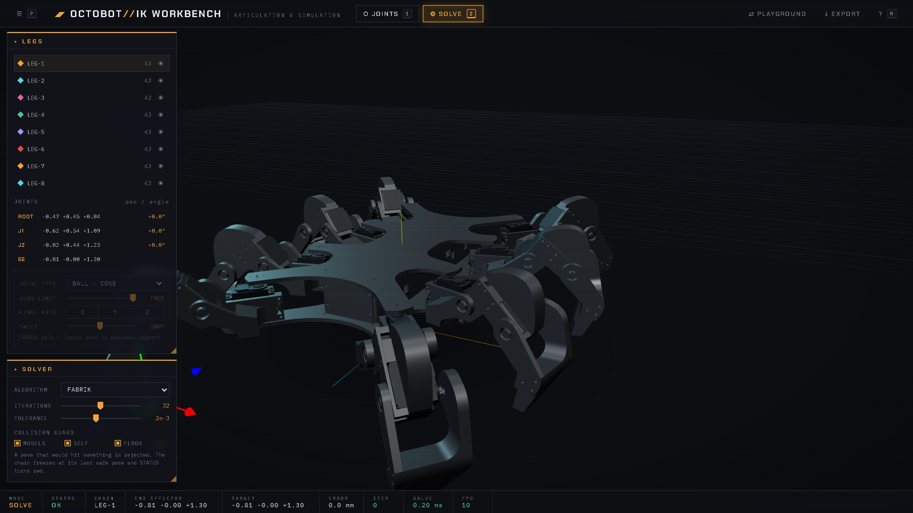
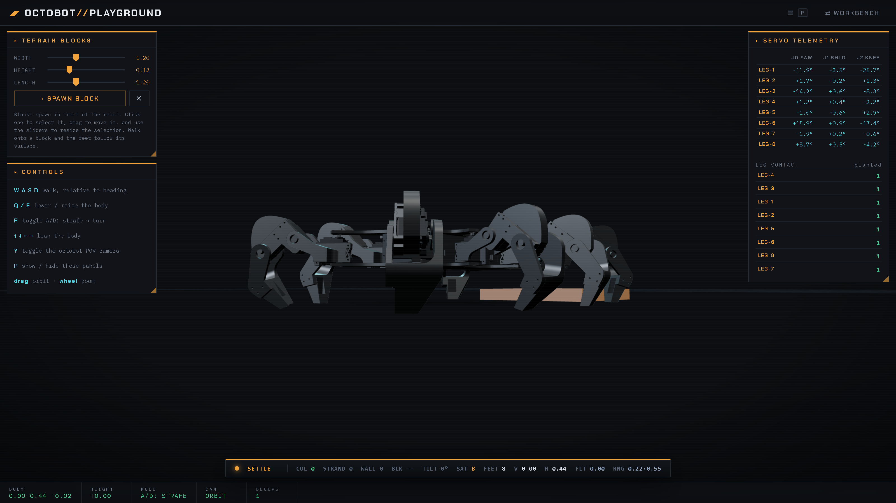

# Octobot

An eight-legged walking robot with 24 servos, built end to end. The chassis and
legs are CAD. A custom ATmega32U4 board drives every servo. A browser workbench
rigs the CAD model and solves its inverse kinematics.



**The workbench runs live in the browser:
<https://deivid-negoita.github.io/octobot/>**. It needs no install and no
build step.

The robot carries environmental-monitoring, 3D-scanning and speleological
payloads. Those payloads need the legs to place feet accurately on uneven
ground, which a fixed gait cannot do. The kinematics workbench in this
repository exists to solve that.

---

## What is here

| Folder | Contents |
|---|---|
| [`kinematics/`](kinematics/) | Browser workbench and locomotion sandbox. Three.js, no build step. |
| [`hardware/`](hardware/) | KiCad 7 project for the 24-channel servo control board. |
| [`mechanical/`](mechanical/) | STEP exports of the chassis and a single leg. |
| [`docs/`](docs/) | [Hardware notes](docs/hardware.md), [kinematics notes](docs/kinematics.md) and the [bill of materials](docs/bom.md). |

The embedded firmware lives in a separate repository and is not included here.

---

## Run the kinematics workbench

The workbench runs in the browser with nothing to install:
**<https://deivid-negoita.github.io/octobot/>**. It is a static site, published
from `kinematics/` by `.github/workflows/pages.yml` on every push to `main`. A
fork gets its own copy after enabling **Settings → Pages → Source → GitHub
Actions** once.

To run it locally instead: the pages load ES modules, so they need an HTTP
server. Opening `index.html` from the filesystem gives you a blank screen and a
CORS error in the console.

```bash
cd kinematics/tools
python serve.py          # or double-click start.bat on Windows
```

Open <http://localhost:8123>. The chassis mesh is about 12 MB, so the first load
takes a few seconds. A progress bar reports the download.

Two pages share the model:

**`index.html`, the IK workbench.** The CAD model rigs itself on startup. The
loader finds the feet from the mesh geometry, then builds a hip-yaw →
shoulder-pitch → knee-pitch chain per leg on the real servo shaft axes. It binds
every servo, bracket and casing to the link it is screwed to. You get eight
chains named `LEG-1` to `LEG-8`. Drag the cyan target and that leg solves toward
it in real time while the servo angles update. Press `Space` to run a gait.

**`playground.html`, the locomotion sandbox.** Drive the robot with `W A S D` over
terrain blocks you spawn and drag. The feet land on the block surface or the
ground by analytic sampling, and the body rides at the average support height.
Live servo angles for all 24 joints stream into the telemetry panel.

| Key | Action |
|---|---|
| `1` / `2` | JOINTS / SOLVE mode (workbench) |
| `Space` | start or stop walking (workbench) |
| `H` | open the help card (workbench) |
| `P` | show or hide the panels (both pages) |
| `W A S D` | walk (playground) |
| `Q` / `E` | lower or raise the body (playground) |
| `Y` | toggle the onboard camera view (playground) |



Read [`docs/kinematics.md`](docs/kinematics.md) for the solver, the collision
guard and the gait model.

---

## The control board

One board drives all 24 servos. An **ATmega32U4** talks over I²C to **two
PCA9685** 16-channel PWM drivers, which gives 32 channels for the 24 servos and
leaves headroom for sensors. An **SY8303** synchronous buck regulator supplies
the servo rail from the battery, and a P-channel MOSFET on the input protects
against reverse polarity.

The 24 servo headers sit on two separate power rails of 12, so the inrush of one
group of legs cannot brown out the other. An **HC-12** radio module plugs into a
4-pin header on D8 and D9. Running the link on a software UART keeps the
hardware USART free and lets the antenna sit away from the servo wiring. The
board is a 4-layer design with 120 placements, an AVR-ISP header, a DIP switch
and two tactile buttons.

Building 24 servo channels from discrete drivers would have cost more and taken
more board area than the two PCA9685s do.

`hardware/fabrication/` holds the package the board house was sent. It carries
gerbers for all four copper layers, both drill files, the IPC netlist, the
placement file and the BOM. Read [`docs/hardware.md`](docs/hardware.md) for the
rail split, the power path and the pin assignment of every header.

### Bill of materials

120 placements over 33 lines: 87 SMT and 33 through-hole. The table is read out of
the layout by [`hardware/tools/gen_bom.py`](hardware/tools/gen_bom.py) rather
than typed. `--check` re-groups the fabrication BOM the same way and compares it
designator by designator, so this list cannot quietly go stale:

```bash
python hardware/tools/gen_bom.py --check
120 placements match octobot-controller-bom.csv exactly.
```

<!-- BOM:START -->

| Qty | Value | Manufacturer part | Package | Ref | Function |
|---:|---|---|---|---|---|
| 2 | `PCA9685PW/Q900_118` | NXP | SOP65P640X110-28N | U1–U2 | 16-channel 12-bit PWM generator. 12 channels used each, at 0x40 and 0x41. |
| 1 | `ATmega32U4-M` | Microchip | QFN-44-1EP_7x7mm_P0.5mm_EP5.2x5.2mm | U3 | Host MCU. Native USB, 16 MHz crystal, I2C master. |
| 1 | `AVR-ISP` | — | AVR-ISP | U4 | ISP header on D14/D15/D16 and RESET. |
| 1 | `SY8303AIC` | Silergy | SOT65P280X110-8N | IC1 | Synchronous buck. VIN down to the 5.0 V logic rail set by R11/R12. |
| 3 | `LED` | — | LED_0201_0603Metric | D1, D3–D4 | Power, RX and TX indicators. |
| 1 | `4,7 uH` | Wurth Elektronik 7447713047 | 7447714220 | L1 | Buck output inductor. |
| 1 | `Crystal_GND24` | — | CRYSTAL-SMD-5X3.2-4PAD | Y1 | MCU clock, loaded by C1/C3. |
| 1 | `HPZR-C10X` | Nexperia | HPZRC10X | D5 | 10 V regulator diode. Clamps the pass FET gate. |
| 1 | `RQ3E075ATTB` | ROHM Semiconductor | RQ3E075ATTB | Q1 | P-channel MOSFET. Reverse-polarity pass element on the input. |
| 28 | `Conn_01x03_Pin` | — | PinHeader_1x03_P2.54mm_Vertical | J2–J8, J10–J14, J17–J30, J32–J33 | 24 servo headers (GND / rail / signal), 2 rail feeds (J29/J30), 2 analog headers (J32/J33). |
| 4 | `1x2` | — | PinHeader_1x02_P2.54mm_Vertical | J9, J16, J31, J34 | Input power (J9), 5 V taps (J16/J34), I2C breakout (J31). |
| 1 | `47346-0001` | Molex | MOLEX_47346-0001 | J1 | USB micro-B receptacle. Programming and 5 V input. |
| 1 | `Conn_01x04_Pin` | — | PinHeader_1x04_P2.54mm_Vertical | J15 | HC-12 radio header: 5 V, GND, D8, D9. |
| 2 | `TL3365AF180QG` | E-Switch | SW_TL3365AF180QG | S1–S2 | Reset (S1) and user button on D12 (S2). |
| 1 | `DS04-254-2-03BK-SMT` | CUI Devices | DS04254203BKSMT | S3 | 3-position DIP switch on D14/D15/D16. |
| 24 | `220 Ohm` | — | R_0603_1608Metric | R31–R54 | Series resistor on each servo signal line. |
| 20 | `10K` | — | R_0603_1608Metric | R1, R5, R8, R10, R14, R16–R30 | PWM address and OE straps, I2C pull-ups, buck enable. |
| 2 | `1K` | — | R_0402_1005Metric | R7, R9 | LED series resistors. |
| 2 | `22 Ohm` | — | R_0603_1608Metric | R2–R3 | USB D+/D- series termination. |
| 1 | `100K` | — | R_1206_3216Metric | R15 | Pass FET gate pull-down. |
| 1 | `100K Ohm` | — | R_0805_2012Metric | R13 | Buck switching-frequency set resistor. |
| 1 | `10KOhm` | — | R_0603_1608Metric | R4 | RESET pull-up. |
| 1 | `110K Ohm` | — | R_0805_2012Metric | R11 | Buck feedback divider, upper leg. |
| 1 | `15K Ohm` | — | R_0805_2012Metric | R12 | Buck feedback divider, lower leg. |
| 1 | `1KOhm` | — | R_0603_1608Metric | R6 | LED series resistor. |
| 6 | `10uF` | — | C_0805_2012Metric | C4–C5, C18–C19, C22–C23 | Rail decoupling. |
| 2 | `0,1uF` | — | C_0603_1608Metric | C17, C21 | Decoupling. |
| 2 | `18pF` | — | C_0603_1608Metric | C1, C3 | Crystal load capacitors. |
| 2 | `1uF` | — | C_0805_2012Metric | C2, C8 | USB UCAP and buck input decoupling. |
| 2 | `875075161013` | Wurth Elektronik | CAPAE1030X1240N | C6, C9 | Aluminium electrolytic. Bulk storage, one per servo rail. |
| 1 | `0.1uF` | — | C_0805_2012Metric | C7 | AREF decoupling. |
| 1 | `10nF` | — | C_1206_3216Metric | C20 | Buck bootstrap. |
| 1 | `12 pF` | — | C_1206_3216Metric | C16 | Buck feedback feed-forward. |

**120 placements over 33 lines: 87 SMT and 33 through-hole.**

<!-- BOM:END -->

Distributor part numbers are not tracked in the KiCad project, so an assembly
house needs those added at order time.

---

## Mechanical

`mechanical/` holds STEP exports of the assembled chassis and of a single leg.
Every part is 3D printed. The chassis was modelled in Autodesk Fusion 360, and
`kinematics/models/octobot.glb` is the mesh export the web app loads.

STEP files are text and compress to roughly 15% of their size, so the repository
carries the zips and ignores the loose exports. The chassis is 52 MB unpacked
and 7.7 MB zipped. Unzip before opening in CAD:

```bash
cd mechanical
unzip octobot-chassis.step.zip
```

---

## Tooling

`kinematics/tools/` holds the development scripts:

```bash
python serve.py          # static server with caching disabled
python verify.py         # drive both pages in Chromium, fail on any console error
python shots.py          # regenerate the README screenshots
```

`verify.py` and `shots.py` need Playwright:

```bash
pip install playwright && playwright install chromium
```

`verify.py` boots each page and asserts that the rig produced eight legs. It
then exercises the help modal, toggles the panels, runs the gait, spawns a
terrain block and walks the robot. It exits non-zero if the browser logged an
error.

---

## Built with

Three.js 0.160 loaded from a CDN, plain ES modules, no bundler and no
dependencies to install. KiCad 7 for the board. Autodesk Fusion 360 for the
mechanics.

## License

MIT. See [LICENSE](LICENSE).
